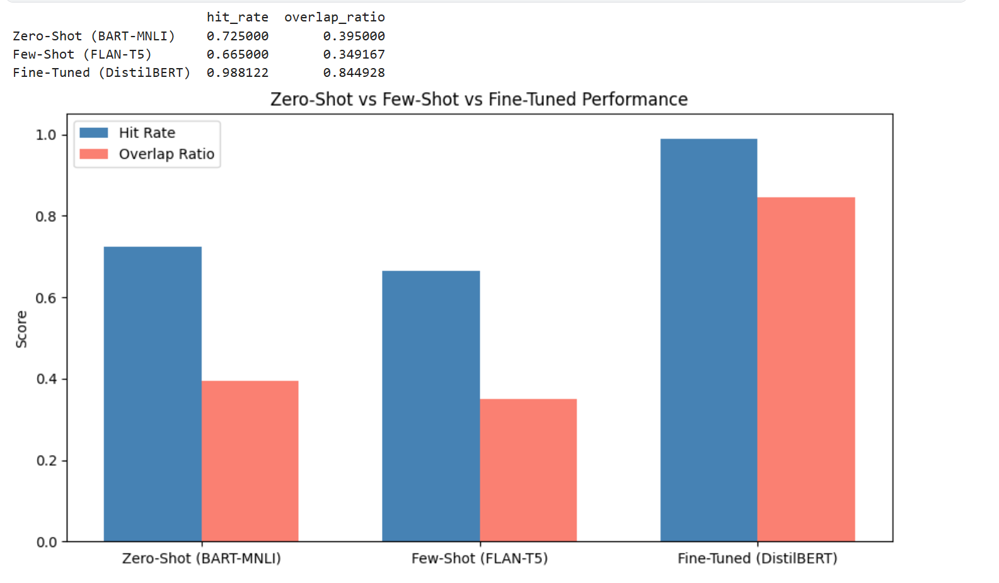

# Task 5: Auto-Tagging Support Tickets Using LLM

## Objective
Automatically tag free-text customer support tickets into relevant categories using a Large Language Model (LLM). The project compares **zero-shot classification**, **few-shot prompting**, and **fine-tuning** approaches, and outputs the **top 3 most probable tags** per ticket to support smarter ticket routing.

## Dataset
**Multilingual Customer Support Ticket Classification Dataset**
🔗 [Kaggle Dataset Link](https://www.kaggle.com/datasets/tobiasbueck/multilingual-customer-support-tickets)

- ~20,000 support tickets across English and German
- Each ticket includes subject, body, type, queue, priority, and multiple tag labels
- Filtered to **11,784 English-language tickets** across the **top 20 most frequent tags** for this task

## Notebook
[View on Kaggle](https://www.kaggle.com/code/YOUR_USERNAME/task5-auto-tagging-support-tickets-llm)
Also available in this repo: [`task5-auto-tagging-support-tickets-llm.ipynb`](./task5-auto-tagging-support-tickets-llm.ipynb)

## Approach
1. **Data Cleaning & EDA** — combined subject + body into ticket text, cleaned noise, resolved a messy 350-value tag space down to the top 20 canonical tags, visualized tag and length distributions
2. **Zero-Shot Classification** — used `facebook/bart-large-mnli` to classify tickets against the 20 candidate tags with no training
3. **Few-Shot Prompting** — used `google/flan-t5-base` with in-context labeled examples to attempt improved tagging via prompt engineering
4. **Fine-Tuning** — fine-tuned `distilbert-base-uncased` as a multi-label classifier (`BCEWithLogitsLoss`, sigmoid outputs) on ~10k labeled tickets
5. **Evaluation** — compared all three approaches using **Hit Rate** (at least 1 correct tag in top 3) and **Overlap Ratio** (fraction of true tags captured)

## Results

| Approach | Hit Rate | Overlap Ratio |
|---|---|---|
| Zero-Shot (BART-MNLI) | 72.5% | 39.5% |
| Few-Shot (FLAN-T5-base) | 66.5% | 34.9% |
| **Fine-Tuned (DistilBERT)** | **98.8%** | **84.5%** |



## Key Findings
- **Zero-shot** classification worked as a reasonable baseline with zero training data, but frequently confused generic labels (e.g. "Customer", "Crash") with the actual ticket issue.
- **Few-shot prompting** with a small instruction-tuned model (FLAN-T5-base) did *not* outperform zero-shot — it struggled to strictly follow the "top 3" format, producing invalid or excessive tags on ~22% of tickets. Larger, more capable instruction-tuned models would likely close this gap.
- **Fine-tuning** on labeled data dramatically outperformed both prompting methods, since it directly learns real tag co-occurrence patterns from the data rather than relying on general label-name understanding.

**Trade-off:** zero-shot/few-shot need no labeled data and deploy instantly but sacrifice accuracy; fine-tuning needs labeled data and training time but delivers production-grade performance.

## Files in This Repo
```
task5-auto-tagging-support-tickets/
├── task5-auto-tagging-support-tickets-llm.ipynb   # Full notebook
├── ticket_tag_predictions.csv                     # Sample predictions (500 tickets)
├── comparison_chart.png                           # Zero-shot vs Few-shot vs Fine-tuned chart
└── README.md
```

## Example Prediction
```
Ticket: "My payment failed twice but the amount was still deducted from my account."

Top 3 Predicted Tags:
  Billing: 0.925
  Customer: 0.027
  Security: 0.022
```

## Skills Gained
- Prompt engineering (zero-shot & few-shot)
- LLM-based multi-label text classification
- Fine-tuning transformer models (DistilBERT)
- Multi-class/multi-label prediction and ranking
- Comparative model evaluation

---

## Internship Task

**AI/ML Engineering Internship**

**DevelopersHub Corporation**

**Task 5:** Auto Tagging Support Tickets Using LLM   

---